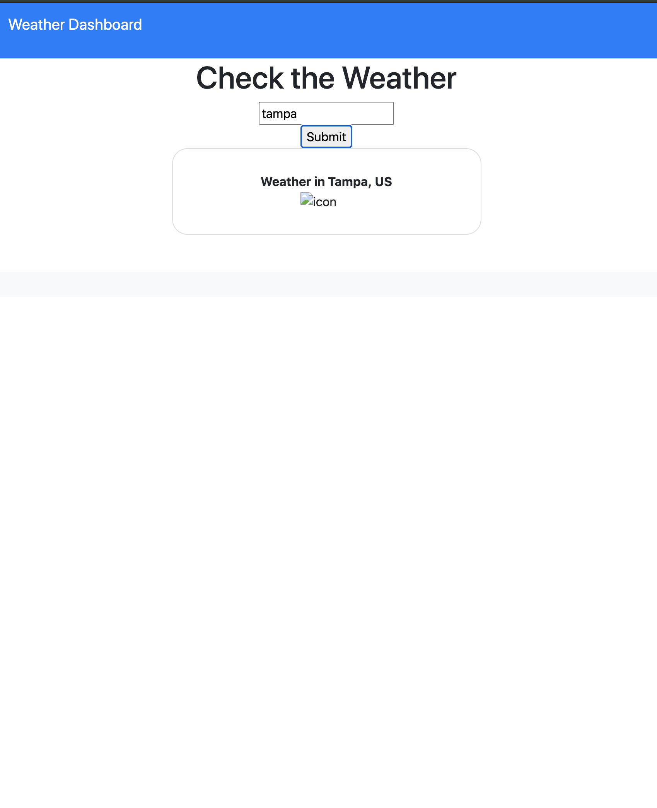

# weather-app

This is a homework assignment for Case Western Reserve University Coding Bootcamp. The purpose of this assignment is to create a weather dashboard that populates weather information about a particular city that is entered.

Links to websites:

https://github.com/michellew179/weather-app/

https://michellew179.github.io/weather-app/

Screenshot of website:

